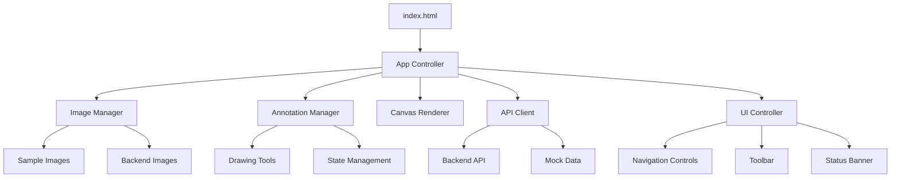

# Design Document

## Overview

The IMA Annotate Frontend is a browser-based annotation interface built with vanilla HTML5, CSS3, and JavaScript (ES6 modules). The system provides an intuitive canvas-based interface for viewing transportation images, displaying AI-generated annotations, and enabling human verification workflows. The design emphasizes modularity, responsiveness, and graceful degradation when backend services are unavailable, automatically falling back to sample mode with dummy API endpoints.

## Architecture

The frontend follows a modular client-side architecture with clear separation of concerns:



### Core Components

- **App Controller**: Main application orchestrator that initializes and coordinates all modules
- **Image Manager**: Handles image loading, caching, and navigation between images
- **Annotation Manager**: Manages annotation data, state changes, and CRUD operations
- **Canvas Renderer**: Responsible for drawing images, annotations, and interactive elements
- **API Client**: Handles all backend communication with fallback to mock data
- **UI Controller**: Manages user interface elements, events, and responsive behavior

## Components and Interfaces

### 1. Configuration Module (config.js)

```javascript
export const CONFIG = {
    API_BASE_URL: "http://localhost:8000/api", // Dummy URL that will fail
    API_KEY: "dummy-api-key-12345", // Dummy API key
    CANVAS_PADDING: 10,
    MAX_CANVAS_WIDTH: 1200,
    MAX_CANVAS_HEIGHT: 800,
    SAMPLE_IMAGES: [
        "img/im-sc1.jpg",
        "img/img-sc2.jpg", 
        "img/img-sc3.jpg"
    ],
    ANNOTATION_COLORS: {
        "Car": "#FF6B6B",
        "Truck": "#4ECDC4", 
        "Bus": "#45B7D1",
        "Motorcycle": "#96CEB4",
        "Bicycle": "#FFEAA7",
        "Person": "#DDA0DD",
        "Other": "#98D8C8"
    },
    STATE_COLORS: {
        "Suggested": "#FFA500",
        "Modified": "#FFD700", 
        "Verified": "#32CD32",
        "Rejected": "#FF6347"
    }
};
```

### 2. API Client Module (js/api-client.js)

**Interface:**
```javascript
class APIClient {
    async testConnection()
    async getImages(page, limit)
    async getAnnotations(imageId)
    async saveAnnotation(annotation)
    async deleteAnnotation(annotationId)
}
```

**Responsibilities:**
- Test API connectivity on initialization (will fail with dummy endpoints)
- Handle authentication with dummy API keys
- Automatically fallback to sample data when API unavailable
- Implement basic retry logic for failed requests
- Provide mock annotations for sample images

### 3. Image Manager Module (js/image-manager.js)

**Interface:**
```javascript
class ImageManager {
    async loadImage(imagePath)
    nextImage()
    previousImage()
    getCurrentImage()
    getImageCount()
    preloadImages()
}
```

**Responsibilities:**
- Load and cache images from API or sample directory
- Handle image navigation with bounds checking
- Preload adjacent images for smooth navigation
- Scale images to fit canvas while maintaining aspect ratio
- Manage image metadata and loading states

### 4. Annotation Manager Module (js/annotation-manager.js)

**Interface:**
```javascript
class AnnotationManager {
    loadAnnotations(imageId)
    createAnnotation(bbox, className, confidence)
    updateAnnotation(id, changes)
    deleteAnnotation(id)
    changeState(id, newState)
    getAnnotationsByState(state)
    exportAnnotations(format)
}
```

**Data Model:**
```javascript
const Annotation = {
    id: String,
    imageId: String,
    bbox: { x: Number, y: Number, width: Number, height: Number },
    className: String,
    confidence: Number,
    state: "Suggested" | "Modified" | "Verified" | "Rejected",
    createdAt: Date,
    modifiedAt: Date,
    segmentationMask: Array // Optional pixel mask data
};
```

### 5. Canvas Renderer Module (js/canvas-renderer.js)

**Interface:**
```javascript
class CanvasRenderer {
    drawImage(image)
    drawAnnotations(annotations)
    drawBoundingBox(annotation)
    drawSegmentationMask(annotation)
    highlightAnnotation(id)
    clearCanvas()
    getCanvasCoordinates(screenX, screenY)
    getScreenCoordinates(canvasX, canvasY)
}
```

**Responsibilities:**
- Render images scaled to fit canvas
- Draw bounding boxes with state-specific styling
- Render segmentation masks as semi-transparent overlays
- Handle coordinate transformations between screen and canvas space
- Provide visual feedback for user interactions
- Support zoom and pan functionality

### 6. Drawing Tools Module (js/drawing-tools.js)

**Interface:**
```javascript
class DrawingTools {
    enableDrawMode()
    disableDrawMode()
    startDrawing(x, y)
    updateDrawing(x, y)
    finishDrawing()
    enableResizeMode(annotationId)
    enableMoveMode(annotationId)
    handleMouseEvents()
    handleTouchEvents()
}
```

**Responsibilities:**
- Handle mouse and touch events for drawing
- Create new bounding boxes via click-and-drag
- Resize existing annotations with corner handles
- Move annotations by dragging
- Provide visual feedback during drawing operations
- Support keyboard shortcuts for tool switching

### 7. UI Controller Module (js/ui-controller.js)

**Interface:**
```javascript
class UIController {
    initializeInterface()
    updateNavigationButtons()
    showStatusBanner(message, type)
    hideStatusBanner()
    updateAnnotationCounts()
    handleToolbarEvents()
    showLoadingIndicator()
    hideLoadingIndicator()
}
```

**Responsibilities:**
- Initialize Bootstrap components and event listeners
- Manage responsive layout adjustments
- Display status messages and error banners
- Update UI state based on application state
- Handle keyboard shortcuts and accessibility features

## Data Models

### Image Model
```javascript
const Image = {
    id: String,
    filename: String,
    path: String,
    width: Number,
    height: Number,
    metadata: {
        captureDate: Date,
        location: String,
        camera: String
    }
};
```

### ROI Model
```javascript
const ROI = {
    id: String,
    imageId: String,
    polygon: Array<{x: Number, y: Number}>,
    name: String,
    active: Boolean
};
```

### Application State Model
```javascript
const AppState = {
    currentImageIndex: Number,
    images: Array<Image>,
    annotations: Map<String, Array<Annotation>>,
    selectedAnnotation: String,
    drawingMode: Boolean,
    apiConnected: Boolean,
    loading: Boolean,
    roi: ROI
};
```

Now I need to use the prework tool to analyze the acceptance criteria before writing the correctness properties:
## Correctness Properties

*A property is a characteristic or behavior that should hold true across all valid executions of a system-essentially, a formal statement about what the system should do. Properties serve as the bridge between human-readable specifications and machine-verifiable correctness guarantees.*

### Property 1: Image Navigation Consistency
*For any* valid image sequence, clicking next should always advance to the subsequent image, and clicking previous should always move to the preceding image
**Validates: Requirements 1.2, 1.3**

### Property 2: Image Scaling Preservation
*For any* image with valid dimensions, scaling to fit the canvas should preserve the original aspect ratio
**Validates: Requirements 1.4**

### Property 3: Configuration Loading Reliability
*For any* valid configuration object containing API_BASE_URL and API_KEY, the frontend should successfully load and apply the configuration
**Validates: Requirements 2.1**

### Property 4: API Error Handling Consistency
*For any* invalid API key or unreachable backend, the frontend should display appropriate error messages in the status banner
**Validates: Requirements 2.3, 2.4**

### Property 5: Annotation Request Consistency
*For any* loaded image, the frontend should request annotations from the backend API
**Validates: Requirements 3.1**

### Property 6: Annotation Rendering Completeness
*For any* set of annotations, all bounding boxes should be rendered as colored rectangles with class labels and confidence scores
**Validates: Requirements 3.2, 3.4**

### Property 7: Segmentation Mask Display
*For any* annotation containing segmentation mask data, the mask should be rendered as a semi-transparent colored overlay
**Validates: Requirements 3.3**

### Property 8: State-Based Visual Styling
*For any* annotation with a verification state, the visual styling should correspond to the state according to the defined color scheme
**Validates: Requirements 3.5**

### Property 9: Class Color Coding
*For any* object class in the FHWA classification system, annotations should be displayed with the corresponding predefined color
**Validates: Requirements 3.6**

### Property 10: Drawing Tool Functionality
*For any* click-and-drag operation on the canvas, a new bounding box should be created with coordinates matching the drag area
**Validates: Requirements 4.1**

### Property 11: Annotation Manipulation Consistency
*For any* existing annotation, resize and move operations should update the annotation coordinates correctly
**Validates: Requirements 4.2, 4.3**

### Property 12: Class Assignment Validity
*For any* newly created annotation, the assigned class should be from the predefined FHWA classification list
**Validates: Requirements 4.4**

### Property 13: State Change on Modification
*For any* annotation that is modified through drawing tools, the verification state should be updated to "Modified"
**Validates: Requirements 4.6**

### Property 14: State Management Consistency
*For any* annotation state change operation (verify, reject, modify), the annotation's state should be updated correctly and reflected in the UI
**Validates: Requirements 5.3, 5.4**

### Property 15: Annotation Count Accuracy
*For any* set of annotations, the summary counts by verification state should accurately reflect the actual distribution of states
**Validates: Requirements 5.5**

### Property 16: ROI Intersection Logic
*For any* defined ROI and set of annotations, only annotations that geometrically intersect with the ROI should be highlighted when ROI filtering is active
**Validates: Requirements 6.2, 6.4**

### Property 17: Responsive Layout Adaptation
*For any* viewport size within supported ranges, the interface should adapt its layout to maintain usability
**Validates: Requirements 7.1**

### Property 18: Keyboard Shortcut Responsiveness
*For any* defined keyboard shortcut, pressing the key combination should trigger the corresponding action
**Validates: Requirements 7.5**

### Property 19: Error Message Display
*For any* API failure or error condition, appropriate error messages should be displayed in the status banner
**Validates: Requirements 8.1, 8.4**

### Property 20: Loading Indicator Consistency
*For any* asynchronous operation (image loading, API requests), loading indicators should be shown during the operation and hidden upon completion
**Validates: Requirements 8.2, 8.3**

### Property 21: Console Logging Completeness
*For any* error condition that occurs, error details should be logged to the browser console
**Validates: Requirements 8.6**

### Property 22: Auto-save Reliability
*For any* annotation modification, changes should be automatically saved to the backend API
**Validates: Requirements 9.1**

### Property 23: Save Retry Logic
*For any* failed save operation, the system should retry the operation and notify the user of persistent failures
**Validates: Requirements 9.3**

### Property 24: Export Format Consistency
*For any* set of annotations, export functionality should produce output in the specified standard formats
**Validates: Requirements 9.4**

### Property 25: Annotation History Tracking
*For any* annotation change, the modification should be recorded in the annotation history
**Validates: Requirements 9.5**

### Property 26: Sample Mode Annotation Functionality
*For any* annotation operation in sample mode, the functionality should work equivalently to live API mode
**Validates: Requirements 10.3**

### Property 27: Mode Transition Smoothness
*For any* transition between sample mode and live API mode, the interface should maintain state consistency and provide smooth user experience
**Validates: Requirements 10.6**

## Error Handling

### API Connectivity Errors
- **Connection Timeout**: Display banner with retry option after 10 seconds
- **Authentication Failure**: Show API key configuration prompt
- **Server Errors (5xx)**: Display temporary service unavailable message
- **Network Errors**: Automatically switch to offline/sample mode

### Image Loading Errors
- **File Not Found**: Display placeholder with error message and skip to next image
- **Corrupt Image Data**: Show error placeholder and log details to console
- **Unsupported Format**: Display format error and provide format requirements

### Annotation Processing Errors
- **Invalid Annotation Data**: Skip malformed annotations and log warnings
- **Coordinate Out of Bounds**: Clamp coordinates to image boundaries
- **Missing Class Information**: Assign "Other" class and mark for review

### User Input Validation
- **Invalid Drawing Operations**: Prevent creation of zero-area bounding boxes
- **Duplicate Annotations**: Warn user and provide merge/replace options
- **State Transition Errors**: Validate state changes and prevent invalid transitions

### Graceful Degradation
- **No Backend Available**: Switch to sample mode with full annotation functionality
- **Partial API Failure**: Disable affected features while maintaining core functionality
- **Browser Compatibility**: Provide fallbacks for unsupported Canvas features

## Testing Strategy

### Manual Testing Approach
Since this is a vanilla HTML/CSS/JavaScript implementation without npm dependencies, testing will focus on manual verification and browser-based testing:

- **Component Testing**: Test individual modules by loading the application in browser and using developer console
- **API Client Testing**: Use dummy API endpoints that will fail, triggering fallback to sample mode
- **Canvas Operations**: Manually test coordinate transformations, drawing operations, and rendering logic
- **State Management**: Verify annotation state transitions through user interactions
- **Error Conditions**: Test error handling by simulating network failures and invalid data scenarios

### Browser-Based Testing Configuration
Testing will be performed directly in the browser using:

- **Console Testing**: Use browser developer console to test individual functions and modules
- **Visual Testing**: Manually verify UI components and interactions work as expected
- **Cross-Browser Testing**: Test functionality across Chrome, Firefox, Safari, and Edge
- **Responsive Testing**: Test interface adaptation across different viewport sizes using browser developer tools

**Example Console Testing:**
```javascript
// Test image navigation in browser console
console.log('Testing image navigation...');
imageManager.nextImage();
console.log('Current image:', imageManager.getCurrentImage());
```

### Integration Testing
- **End-to-End Workflows**: Test complete annotation workflows from image loading to export
- **API Integration**: Test real backend communication with test data
- **Cross-Browser Compatibility**: Verify functionality across Chrome, Firefox, Safari, and Edge
- **Responsive Design**: Test interface adaptation across different viewport sizes

### Manual Testing Scenarios
- **Usability Testing**: Verify intuitive operation for annotation workflows
- **Performance Testing**: Ensure smooth operation with large image sets and many annotations
- **Accessibility Testing**: Verify keyboard navigation and screen reader compatibility
- **Visual Regression Testing**: Ensure UI consistency across updates

### Test Data Management
- **Sample Images**: Use provided transportation images for consistent testing
- **Mock Annotations**: Generate realistic annotation data for various object classes
- **Edge Case Data**: Create test cases for boundary conditions and error scenarios
- **Performance Data**: Use large datasets to test scalability limits

The testing strategy emphasizes both automated verification of correctness properties and manual validation of user experience, ensuring the frontend meets both functional and usability requirements for transportation vision annotation workflows.